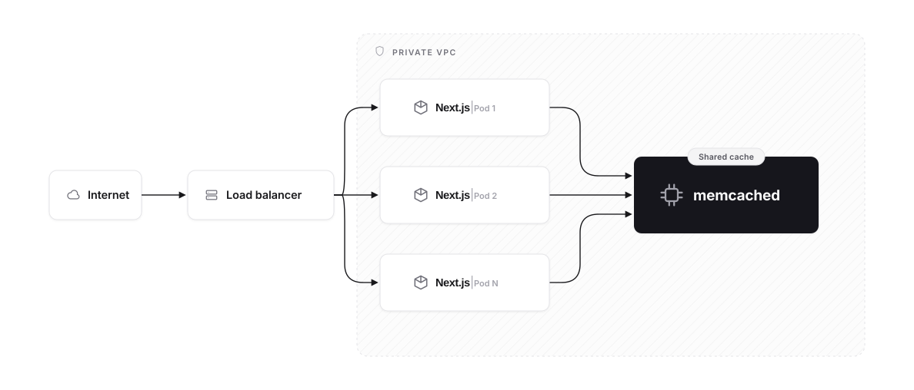
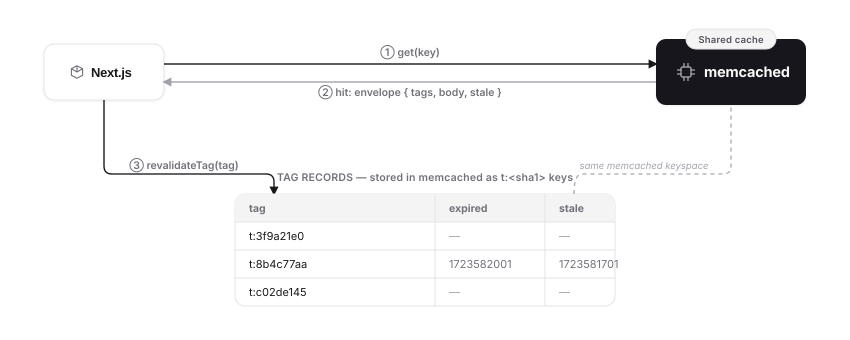

# How it works

The design goal, in one line: **a dead or evicting memcached may cost extra cache misses, but can never serve stale data and can never break a render.**

<p align="center">
  <picture>
    <source media="(prefers-color-scheme: dark)" srcset="assets/architecture-dark.svg">
    <source media="(prefers-color-scheme: light)" srcset="assets/architecture-light.svg">
    
  </picture>
</p>

## Keys

Cache keys are hashed to `e:<sha1(cacheKey)>` and tags to `t:<sha1(tag)>`: memcached keys are limited to 250 bytes with no whitespace, and Next's `'use cache'` keys (which already embed the `BUILD_ID`) exceed that.

## Envelope (v1)

Each entry is stored as a self-describing JSON string:

```json
{ "v": 1, "tags": [], "stale": 0, "timestamp": 0, "expire": 0, "revalidate": 0, "body": "<base64>" }
```

- Version field first: any parse error, shape mismatch, or unknown version decodes as a **miss**, which is safe for rolling deploys with mixed pod versions.
- Entries whose encoded size exceeds **900 KB** are skipped on write (headroom under memcached's ~1 MB item cap); a warning is logged when `NEXT_PRIVATE_DEBUG_CACHE=1`.

## Tag invalidation: versioned records, no key lists

<p align="center">
  <picture>
    <source media="(prefers-color-scheme: dark)" srcset="assets/architecture-invalidation-dark.svg">
    <source media="(prefers-color-scheme: light)" srcset="assets/architecture-invalidation-light.svg">
    
  </picture>
</p>

There is no tag-to-keys index (memcached can't enumerate, and an LRU-evicted key list would silently serve stale data forever). Instead, each tag gets one tiny record `{ expired?, stale? }` (absolute ms timestamps), mirroring the algorithm of [Next's built-in in-memory handler](https://github.com/vercel/next.js/blob/canary/packages/next/src/server/lib/cache-handlers/default.ts) (the reference implementation behind the [`cacheHandlers` docs](https://nextjs.org/docs/app/api-reference/config/next-config-js/cacheHandlers)):

- `get()` fetches the records for the entry's tags **and** the soft tags Next passes in, in one batched multi-get. A record with `expired > entry.timestamp` means a miss (**hard** invalidation). A record with `stale > entry.timestamp` means the entry is served once with `revalidate: -1`, Next's serve-stale-while-revalidate sentinel (**soft**).
- `updateTags(tags)` with no durations (what `updateTag(tag)` and `revalidateTag(tag, { expire: 0 })` produce) bumps `expired = now`: hard. With durations (what `revalidateTag(tag, 'max')` produces) it bumps `stale = now`: soft.
- Invalidation is **O(1) per tag** no matter how many entries carry it; invalidated entries are never enumerated or deleted, they just fail the comparison and age out via TTL.
- `getExpiration()` returns `Infinity`, which tells Next to pass soft tags into `get()` for checking there. `refreshTags()` is a no-op: records are read fresh on every `get()`.

## Fail-safe on evicted tag records

A tag with no record (LRU-evicted, or never seen) is treated as `{ expired: now }` for that read and re-seeded fire-and-forget via `add` (so a concurrent real invalidation wins). An evicted record *might* have carried a lost invalidation, so it must read as "just invalidated", never "never invalidated". Net effect: **eviction costs one extra miss per cold tag, and can never serve stale data.** Entries written after the re-seed have `timestamp > expired` and hit normally.

This also means the **first read of a never-before-seen tag is a one-time miss by design**, visible in fresh environments and demos, harmless in production.

## TTL clamp

Entry TTLs are clamped to **[1 s, 30 days]**. The underlying client coerces zero/negative/NaN expirations to "never expire", the opposite of memcached semantics, and TTL-0 items are exempt from ElastiCache Serverless LRU eviction (an OOM risk). Entries with `expire === 0` (dynamic, never served back) are drained but never written, matching the built-in handler.

## Concurrency

A `get()` racing a pending `set()` for the same key awaits the write instead of returning a spurious miss (`pendingSets` map, mirroring the built-in handler). `set()` always fully drains the entry's `ReadableStream`, even on skip paths, so Next's render never stalls on an unread writer.

## Failure modes

Every handler method body is wrapped in a total exception guard returning the safe default: a dead memcached degrades to "no caching", never to a render error.

| Condition | Behavior |
| --- | --- |
| memcached down / unreachable | every op resolves safely within the 750 ms op timeout: `get` reads as a miss, `set` / `updateTags` / `refreshTags` are silent no-ops |
| corrupt or unknown-version envelope | miss |
| entry > 900 KB encoded | write skipped (warn under `NEXT_PRIVATE_DEBUG_CACHE=1`) |
| tag record evicted / never seen | one extra miss for that tag, record re-seeded, self-heals |
| invalidation dropped while down | safe; reads are misses too while the cache is down |

## IMPORTANT: the page-level cache is a separate layer

Next's **page-level incremental cache** (the PPR / ISR static shell, stored on per-pod disk under `.next/server/app/`) is a third caching layer that `cacheHandlers` does **not** replace. With `cacheComponents`, any `'use cache'` fragment whose `stale` is at or above the route's stale-time gets embedded in the cached page shell and served from per-pod disk **without ever consulting this handler**, observed as fragments "still cached" while memcached was down.

To guarantee fragments always resume through the handler, render them inside a dynamic subtree: `await connection()` under a `<Suspense>` boundary (Cache Components rejects dynamic APIs outside Suspense at build time):

```tsx
import { connection } from "next/server";
import { Suspense } from "react";

async function CachedSections() {
  await connection(); // opts this subtree out of the prerendered shell
  return <MyUseCacheFragments />;
}

export default function Page() {
  return (
    <Suspense fallback="loading">
      <CachedSections />
    </Suspense>
  );
}
```

A real deployment must either do the same, accept bounded per-pod divergence up to the route stale-time during outages, or additionally back the legacy `cacheHandler` with memcached.

## Current limitations

What's planned lives in the [roadmap](./roadmap.md); what's in and out of scope per Next.js feature lives in the [compatibility matrix](./nextjs-compatibility.md#feature-compatibility-matrix). The limitations that shape behavior today:

- **No circuit breaker.** While memcached is down, each op pays up to the 750 ms timeout instead of short-circuiting instantly.
- **Single memcached target, single connection.** `MEMCACHED_URI` takes one `host:port`, and every request in a pod shares one pipelined connection to it.
- **No telemetry.** Observability is `NEXT_PRIVATE_DEBUG_CACHE=1` logging for now.
- **`'use cache: private'` and the legacy `cacheHandler` surface (ISR, `fetch`, Pages Router) are out of scope**; the [matrix](./nextjs-compatibility.md#feature-compatibility-matrix) has the details and workarounds.
